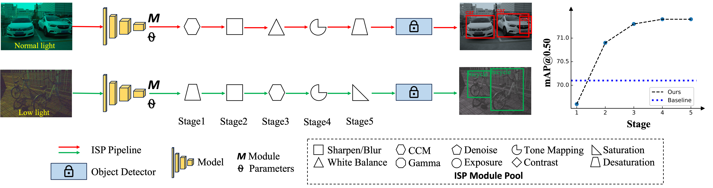

# [NeurIPS2024] AdaptiveISP: Learning an Adaptive Image Signal Processor for Object Detection
### [Project Page](https://openimaginglab.github.io/AdaptiveISP/) | [Paper](https://arxiv.org/pdf/2410.22939) | [Data](https://pan.baidu.com/s/1tQieluAmQlg_aqmsU0iWyQ?pwd=nips) <br>

Yujin Wang, Tianyi Xu, Fan Zhang, Tianfan Xue, Jinwei Gu <br><br>

<p align="left" width="100%">
    
</p>
    AdaptiveISP takes a raw image as input and automatically generates an optimal ISP pipeline $\{M_i\}$ and the associated ISP parameters $\{\Theta_i\}$ to maximize the detection performance for any given pre-trained object detection network with deep reinforcement learning. AdapativeISP achieved mAP@0.5 of 71.4 on the dataset LOD dataset, while a baseline method with a fixed ISP pipeline and optimized parameters can only achieve mAP@0.5 of 70.1. Note that AdaptiveISP predicts the ISP for the image captured under normal light requires a CCM module, while the ISP for the image captured under low light requires a Desaturation module.

## Abstract
Image Signal Processors (ISPs) convert raw sensor signals into digital images, which significantly influence the image quality and the performance of downstream computer vision tasks. 
Designing ISP pipeline and tuning ISP parameters are two key steps for building an imaging and vision system.
To find optimal ISP configurations, recent works use deep neural networks as a proxy to search for ISP parameters or ISP pipelines. However, these methods are primarily designed to maximize the image quality, which are sub-optimal in the performance of high-level computer vision tasks such as detection, recognition, and tracking. Moreover, after training, the learned ISP pipelines are mostly fixed at the inference time, whose performance degrades in dynamic scenes. 
To jointly optimize ISP structures and parameters, we propose AdaptiveISP, a task-driven and scene-adaptive ISP. 
One key observation is that for the majority of input images, only a few processing modules are needed to improve the performance of downstream recognition tasks, and only a few inputs require more processing.
Based on this, AdaptiveISP utilizes deep reinforcement learning to automatically generate an optimal ISP pipeline and the associated ISP parameters to maximize the detection performance. Experimental results show that AdaptiveISP not only surpasses the prior state-of-the-art methods for object detection but also dynamically manages the trade-off between detection performance and computational cost, especially suitable for scenes with large dynamic range variations.

## Installation
### Set up the python environment
```
conda create -n adaptiveisp python=3.10
conda activate adaptiveisp
conda install pytorch==2.0.1 torchvision==0.15.2 torchaudio==2.0.2 pytorch-cuda=11.8 -c pytorch -c nvidia

git clone https://github.com/OpenImagingLab/AdaptiveISP.git
cd AdaptiveISP
pip install -r requirements.txt
```

## Prepare Dataset
1. Download the LOD dataset from [Baidu Drive](https://pan.baidu.com/s/1tQieluAmQlg_aqmsU0iWyQ?pwd=nips) or [OneDrive](https://1drv.ms/u/s!Aq1PSygduHX9czHB9WkUNUTUx8o?e=KURDwo).
2. Unzip the LOD, and modify the dataroot yolov3/data/lod.yaml

## Training and Test
### Training
To train the AdaptiveISP model:
1. Modify the dataroot yolov3/data/lod.yaml
2. Training without runtime_penalty
    ```bash
    CUDA_VISIBLE_DEVICES=0 python train.py \
        --batch_size=8 \
        --data_name=lod \
        --data_cfg=yolov3/data/lod.yaml \
        --save_path=adaptive-isp
    ```
3. Training with runtime_penalty
    ```bash
    CUDA_VISIBLE_DEVICES=0 python train.py \
        --batch_size=8 \
        --add_noise=False \
        --data_name=lod \
        --data_cfg=yolov3/data/lod.yaml \
        --save_path=adaptive-isp \
        --runtime_penalty \
        --runtime_penalty_lambda=5e-3
    ```

### Test
Test the AdaptiveISP model on LOD dataset:
1. Modify the dataroot yolov3/data/lod.yaml
2. Download the pretrained model and put in pretrained folder. 

    - [ckpt-lod-df-1.0](https://github.com/OpenImagingLab/AdaptiveISP/releases/download/v1.0/ckpt-lod-df-0.98.pth): training with discount facotr(1.0)

    - [ckpt-lod-df-0.98](https://github.com/OpenImagingLab/AdaptiveISP/releases/download/v1.0/ckpt-lod-df-1.0.pth): training with discount facotr (0.98)

    - [yolov3](https://github.com/OpenImagingLab/AdaptiveISP/releases/download/v1.0/yolov3.pt): pretrined model on COCO

2. Run
    ```bash
    CUDA_VISIBLE_DEVICES=0 python yolov3/val_adaptiveisp.py \
        --project=results \
        --isp_weights=pretrained/ckpt-lod-df-1.0.pth \
        --data_name=lod \
        --data=yolov3/data/lod.yaml \
        --batch-size=1 \
        --steps=5 \
        --name=adptiveisp \
        --save_image \
        --save_param
    ```

## Citations
```
@article{wang2024adaptiveisp,
      title={AdaptiveISP: Learning an Adaptive Image Signal Processor for Object Detection}, 
      author={Yujin Wang and Tianyi Xu and Fan Zhang and Tianfan Xue and Jinwei Gu},
      booktitle={Conference on Neural Information Processing Systems},
      year={2024}
}
```

## Acknowledgements
Related research projects and implementations. We thank the original authors for their excellent work.
- [LODDataset](https://github.com/ying-fu/LODDataset)

- [YOLOv3](https://github.com/ultralytics/yolov3)
